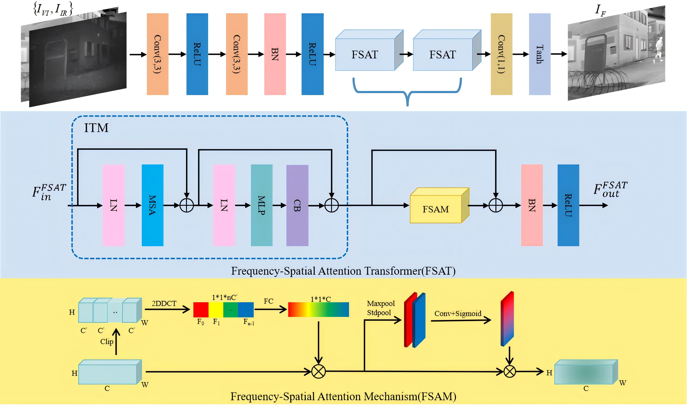
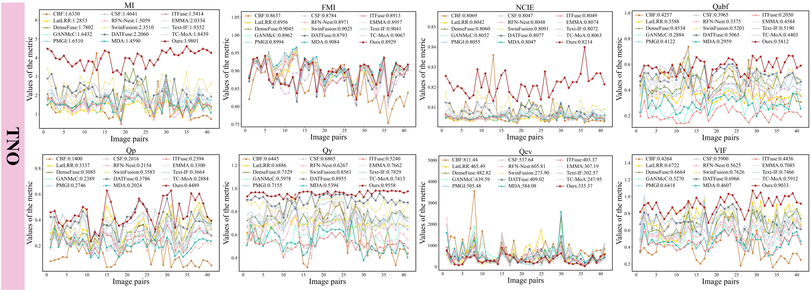

# [CVIU 2026] FSATFusion: Frequency-Spatial Attention Transformer for infrared and visible image fusion
### [Paper](https://www.sciencedirect.com/science/article/abs/pii/S1077314225003236) | [Code](https://github.com/Lmmh058/FSATFusion) 

**FSATFusion: Frequency-Spatial Attention Transformer for infrared and visible image fusion (CVIU 2026)**



## Prepare Your Dataset
The dataset used in this paper can be downloaded at:
[TNO](https://figshare.com/articles/dataset/TNO_Image_Fusion_Dataset/1008029) | [LLVIP](https://bupt-ai-cz.github.io/LLVIP/) | [MSRS](https://github.com/Linfeng-Tang/MSRS) | [RoadScene](https://github.com/hanna-xu/RoadScene) | [RGBNIR](https://www.epfl.ch/labs/ivrl/research/downloads/rgb-nir-scene-dataset/)

The images you use should be placed in:
```bash
    Source_image_{dataset}/
                ir/
                vi/
    Train/
                ir/
                vi/
```

## Pretrained Weights
Our pre-trained model is available at ```./models/abc```.

## Testing
You can test the fusion performance of the model using the following command, after correctly placing the test images and the pretrained model:
```
python Test.py
```

## Visual Results
A few qualitative examples are shown below.


## Quantitative Results
Quantitative comparison examples are shown below. The red line denotes our method.



## Training your own model
Put your training data in the ```train_image``` folder, and run:
```
python Train.py
```
Afterwards, your model will be placed in ```./models/abc```.

## Citation
If our work contributes to your research, please cite it as:
```
@article{ZHANG2026104600,
title = {FSATFusion: Frequency-Spatial Attention Transformer for infrared and visible image fusion},
journal = {Computer Vision and Image Understanding},
volume = {263},
pages = {104600},
year = {2026},
issn = {1077-3142},
doi = {https://doi.org/10.1016/j.cviu.2025.104600},
url = {https://www.sciencedirect.com/science/article/pii/S1077314225003236},
author = {Tianpei Zhang and Jufeng Zhao and Yiming Zhu and Guangmang Cui and Yuhan Lyu},
keywords = {Infrared and visible image fusion, Transformer, Deep learning, Attention mechanism},
abstract = {The infrared and visible images fusion (IVIF) is receiving increasing attention from both the research community and industry due to its excellent results in downstream applications. However, existing deep learning methods exhibit limitations in global feature modeling, balancing fusion performance with computational efficiency and effectively leveraging frequency-domain information. To address this limitation, we propose an end-to-end fusion network named the Frequency-Spatial Attention Transformer Fusion Network (FSATFusion). The FSATFusion contains the frequency-spatial attention Transformer (FSAT) module designed to effectively capture discriminate features from source images. The FSAT module includes a frequency-spatial attention mechanism (FSAM) capable of extracting significant features from feature maps. Additionally, we propose an improved Transformer module (ITM) to enhance the ability to extract global context information of vanilla Transformer without incurring additional computational overhead. Across four public datasets (TNO, MSRS, RoadScene, and RGB–NIR), we conducted extensive qualitative comparisons and quantitative evaluations based on eight metrics against fourteen representative state-of-the-art fusion algorithms. Experimental results demonstrate that the proposed method outperforms state-of-the-art deep learning approaches (e.g., GANMcC, MDA, and EMMA) in terms of qualitative visual quality, objective metrics (e.g., achieving an average improvement of approximately 34% in MI, 5% in Qy, and 4% in VIF), as well as computational efficiency. Furthermore, the fused images generated by our method exhibit superior applicability and performance in downstream object detection tasks. Our code is available at https://github.com/Lmmh058/FSATFusion.}
}
```
